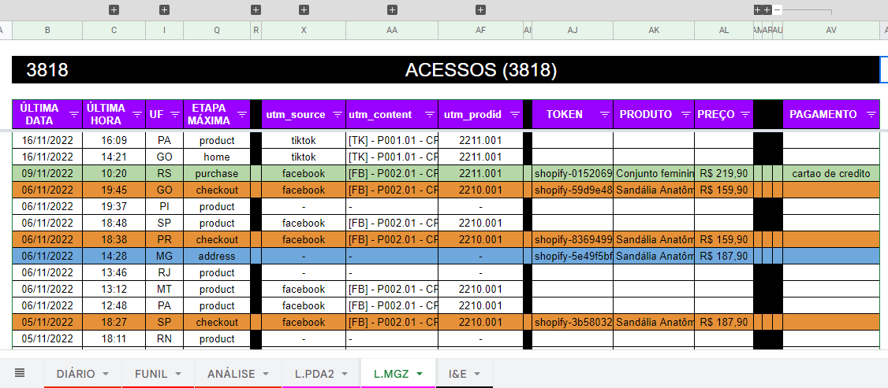

  
  
  

  <!-- <DYNFIELD:ALL_PROJECTS> -->
  <a href="https://github.com/lucasvtiradentes/lucasvtiradentes/blob/master/portfolio/PROJECTS.md#TOC">projects (25)</a>
  <!-- </DYNFIELD:ALL_PROJECTS> -->
   •
  <a href="https://github.com/lucasvtiradentes/my-tutorials/blob/master/README.md#TOC">articles (7)</a>

<!-- <DYNFIELD:FEATURED_PROJECTS> -->

  
<b>⭐ featured projects (6)</b>

   
  

    <table>
      <tr>
        <th width="215">Project</th>
        <th width="400">Description</th>
        <th width="215">Demo</th>
        <th align="center" width="100">Tech</th>
      </tr>
      <tr>
        <td align="center"><a href="https://github.com/lucasvtiradentes/gcal-sync#readme">gcal-sync</a> </td>
        <td>🔄 add an one way synchronization from ticktick/github to google calendar and track your progress effortlessly.</td>
        <td align="center"></td>
        <td>
          
          
          
        </td>
      </tr>
      <tr>
        <td align="center"><a href="https://github.com/lucasvtiradentes/boilermanager#readme">boilermanager</a> </td>
        <td>⚡ a boilerplate manager to let you start your projects lightning fast.</td>
        <td align="center"></td>
        <td>
          
          
        </td>
      </tr>
      <tr>
        <td align="center"><a href="https://github.com/lucasvtiradentes/shopify-store-omni-pixel#readme">shopify-store-omni-pixel</a> </td>
        <td>🔎 Save webstore' visitors behavior information into cookies and send events to ads and analytics platforms, such as GA, Facebook and Tiktok.</td>
        <td align="center"></td>
        <td>
          
          
        </td>
      </tr>
      <tr>
        <td align="center"><a href="https://github.com/lucasvtiradentes/esports-notifier#readme">esports-notifier</a> </td>
        <td>🔔 Receive a daily email informing whenever at least one of your favorite esports teams has a match on the current date.</td>
        <td align="center"></td>
        <td>
          
          
        </td>
      </tr>
      <tr>
        <td align="center"><a href="https://github.com/lucasvtiradentes/twitch-notifier#readme">twitch-notifier</a> </td>
        <td>🔔 get email notifications whenever your favorite twitch streamers go live.</td>
        <td align="center"></td>
        <td>
          
          
        </td>
      </tr>
      <tr>
        <td align="center"><a href="https://github.com/lucasvtiradentes/dyn-markdown#readme">dyn-markdown</a> </td>
        <td>📖 easily handle markdown files in nodejs based projects, including add, update and delete fields dynamically.</td>
        <td align="center"></td>
        <td>
          
          
        </td>
      </tr>
    </table>
  

<!-- </DYNFIELD:FEATURED_PROJECTS> -->

  
<b>📈 coding stats</b>

   
  

    
  

  

    
    
  

  

    
    
  

  
<b>👨‍💻 tech stack</b>

   
  

    
    
    
    
     
    
    
    
    
  

  
<b>🥋 accounts</b>

   
  

  
  
   
  
  
   
  
  
  
  

  
<b>🶠pets</b>

   
  

    <table>
      <tr>
        <th>Teo</th>
        <th>Belinha</th>
      </tr>
      <tr>
        <td>The most cute and happy buddy I've ever met, he thinks everything is related to his daily walks. If you smile or touch the wrong object, you'll probably have to take him out to enjoy his dog friends.</td>
        <td>If you need to learn about impose boundaries, you need to hang out with her. You might get hurt by just  touching in her belly or feet. Also she has already slept in 98% of all possible places in her house.</td>
      </tr>
      <tr width="100%">
        <td width="50%"></td>
        <td width="50%"></td>
      </tr>
      <tr width="100%">
        <td width="50%"></td>
        <td width="50%"></td>
      </tr>
    </table>
  

  

