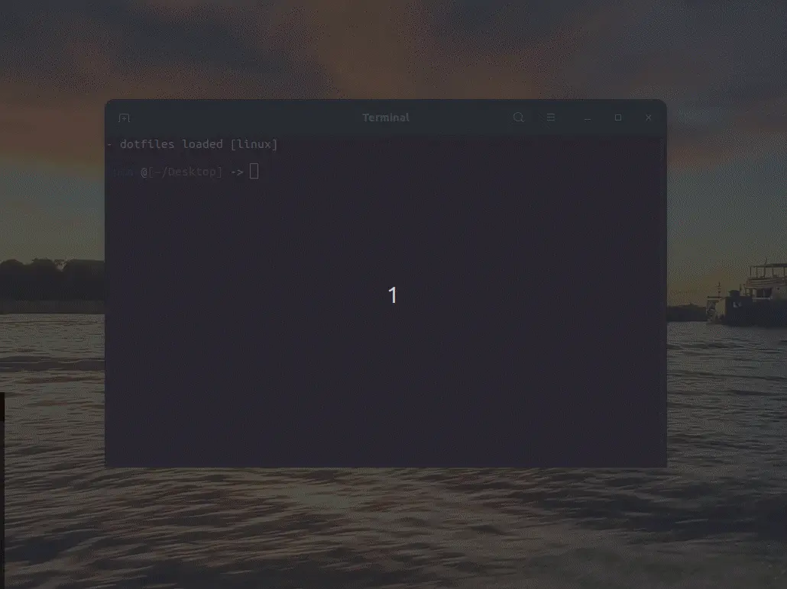

  
  
  

  <!-- <DYNFIELD:ALL_PROJECTS> -->
  <a href="https://github.com/lucasvtiradentes/lucasvtiradentes/blob/master/portfolio/PROJECTS.md#TOC">projects (29)</a>
  <!-- </DYNFIELD:ALL_PROJECTS> -->
   •
  <a href="https://github.com/lucasvtiradentes/my-tutorials/blob/master/README.md#TOC">articles (7)</a>

<!-- <DYNFIELD:FEATURED_PROJECTS> -->

  
<b>⭐ featured projects (5)</b>

   
  

    <table>
      <tr>
        <th width="215">project</th>
        <th width="400">description</th>
        <th width="215">image</th>
        <th align="center" width="100">tech</th>
      </tr>
      <tr>
        <td align="center"><a href="https://github.com/lucasvtiradentes/gcal-sync#readme">gcal-sync</a> </td>
        <td>🔄 add an one way synchronization from ticktick/github to google calendar and track your progress effortlessly.</td>
        <td align="center"></td>
        <td>
          
          
          
          
        </td>
      </tr>
      <tr>
        <td align="center"><a href="https://github.com/lucasvtiradentes/page_actions_attacher#readme">page_actions_attacher</a> </td>
        <td>🤖 tampermonkey helper package that enables easy addition of custom actions to specific pages, making it particularly valuable for simplifying form-filling tasks.</td>
        <td align="center"></td>
        <td>
          
          
        </td>
      </tr>
      <tr>
        <td align="center"><a href="https://github.com/lucasvtiradentes/repositories_utils#readme">repositories_utils</a> </td>
        <td>🔄 sync and manage your git repositories effortlessly.</td>
        <td align="center"></td>
        <td>
          
          
          
        </td>
      </tr>
      <tr>
        <td align="center"><a href="https://github.com/lucasvtiradentes/shopify-store-omni-pixel#readme">shopify-store-omni-pixel</a> </td>
        <td>🔎 Save webstores user behavior information into cookies and send events to ads and analytics platforms, like GA, Facebook and Tiktok</td>
        <td align="center"></td>
        <td>
          
          
        </td>
      </tr>
      <tr>
        <td align="center"><a href="https://github.com/lucasvtiradentes/ticktick-api-lvt#readme">ticktick-api-lvt</a> </td>
        <td>📅 a ticktick api wrapper package to be used in node based projects.</td>
        <td align="center">N/A</td>
        <td>
          
          
        </td>
      </tr>
    </table>
  

<!-- </DYNFIELD:FEATURED_PROJECTS> -->

  
<b>📈 coding stats</b>

   
  

    
  

  

    
    
  

  

    
    
  

 

  

