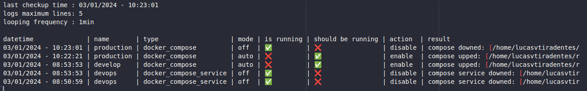
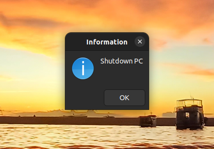
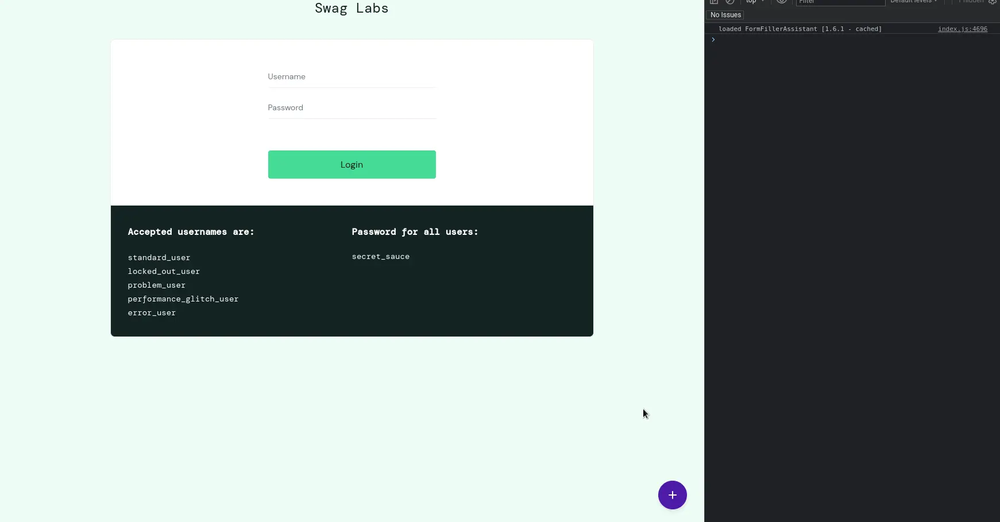
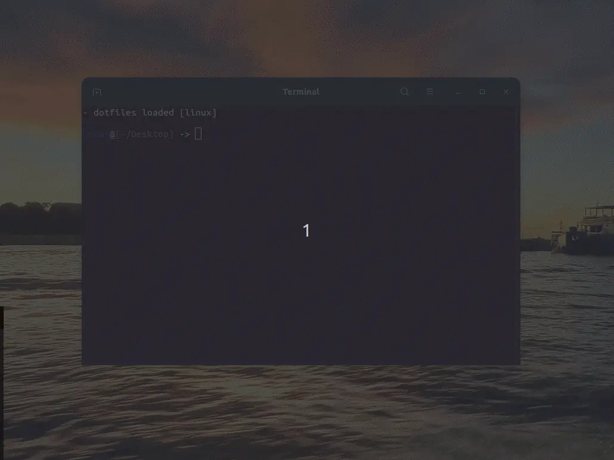
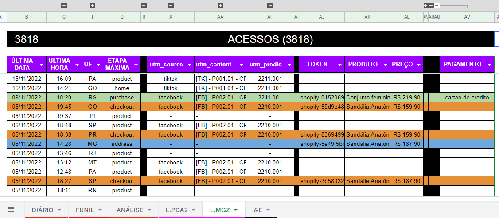
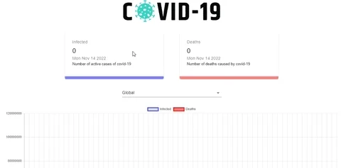
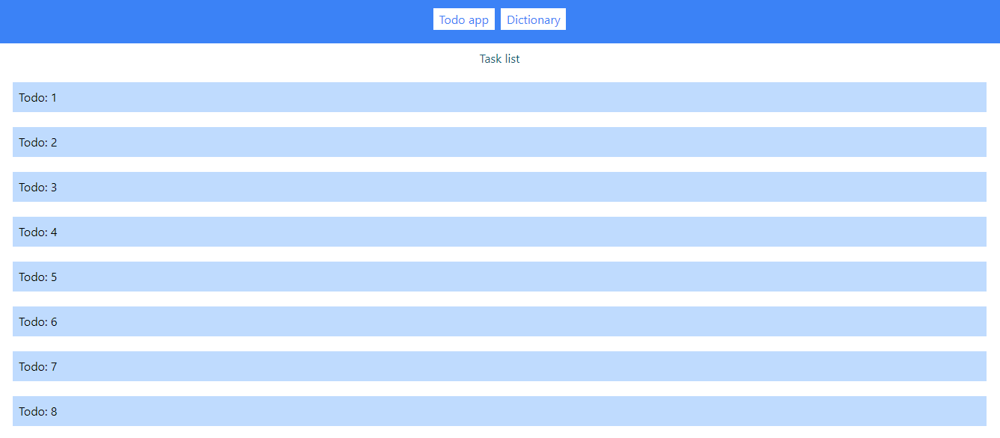
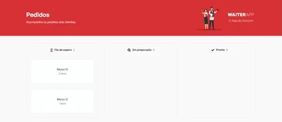

<h3 align="center">
  <!-- <DYNFIELD:PROJECTS_COUNT> -->
  ALL MY GITHUB PROJECTS (28)
  <!-- </DYNFIELD:PROJECTS_COUNT> -->
</h3>

  
  
  
  

  <a href="#star-open-source-projects">
  <!-- <DYNFIELD:OPEN_SOURCE_COUNT> -->
  open source (13)
  <!-- </DYNFIELD:OPEN_SOURCE_COUNT> -->
  </a> •
  <a href="#zap-personal-projects">
  <!-- <DYNFIELD:PERSONAL_COUNT> -->
  personal (2)
  <!-- </DYNFIELD:PERSONAL_COUNT> -->
  </a> •
  <a href="#briefcase-freelance-projects">
  <!-- <DYNFIELD:FREELANCE_COUNT> -->
  freelance (5)
  <!-- </DYNFIELD:FREELANCE_COUNT> -->
  </a> •
  <a href="#books-portfolio-projects">
  <!-- <DYNFIELD:PORTFOLIO_COUNT> -->
  portfolio (8)
  <!-- </DYNFIELD:PORTFOLIO_COUNT> -->
  </a>

## :star: open source projects

<!-- <DYNFIELD:OPEN_SOURCE_TABLE> -->

<table>
  <tr>
    <th width="215">project</th>
    <th width="400">description</th>
    <th width="215">image</th>
    <th align="center" width="100">tech</th>
  </tr>
  <tr>
    <td align="center"><a href="https://github.com/lucasvtiradentes/boilermanager#readme">boilermanager</a> </td>
    <td>⚡ boilerplate manager to let you start your projects lightning fast.</td>
    <td align="center"></td>
    <td>
      
      
    </td>
  </tr>
  <tr>
    <td align="center"><a href="https://github.com/lucasvtiradentes/container_scheduler#readme">container_scheduler</a> </td>
    <td>📅 container scheduler package with minimum configuration.</td>
    <td align="center"></td>
    <td>
      
      
    </td>
  </tr>
  <tr>
    <td align="center"><a href="https://github.com/lucasvtiradentes/dyn-markdown#readme">dyn-markdown</a> </td>
    <td>📖 easily handle markdown files in nodejs based projects, including add, update and delete fields dynamically.</td>
    <td align="center"></td>
    <td>
      
      
    </td>
  </tr>
  <tr>
    <td align="center"><a href="https://github.com/lucasvtiradentes/esports-notifier#readme">esports-notifier</a> </td>
    <td>🔔 Receive a daily email informing whenever at least one of your favorite esports teams has a match on the current date.</td>
    <td align="center"></td>
    <td>
      
    </td>
  </tr>
  <tr>
    <td align="center"><a href="https://github.com/lucasvtiradentes/gcal-sync#readme">gcal-sync</a> </td>
    <td>🔄 add an one way synchronization from ticktick/github to google calendar and track your progress effortlessly.</td>
    <td align="center"></td>
    <td>
      
      
      
      
    </td>
  </tr>
  <tr>
    <td align="center"><a href="https://github.com/lucasvtiradentes/linux_reminder#readme">linux_reminder</a> </td>
    <td>⏰ simple reminder designed to be used in daily tasks on linux.</td>
    <td align="center"></td>
    <td>
      
    </td>
  </tr>
  <tr>
    <td align="center"><a href="https://github.com/lucasvtiradentes/page_actions_attacher#readme">page_actions_attacher</a> </td>
    <td>🤖 tampermonkey helper package that enables easy addition of custom actions to specific pages, making it particularly valuable for simplifying form-filling tasks.</td>
    <td align="center"></td>
    <td>
      
      
    </td>
  </tr>
  <tr>
    <td align="center"><a href="https://github.com/lucasvtiradentes/repositories_manager#readme">repositories_manager</a> </td>
    <td>🔄 sync and manage your git repositories effortlessly.</td>
    <td align="center"></td>
    <td>
      
      
      
    </td>
  </tr>
  <tr>
    <td align="center"><a href="https://github.com/lucasvtiradentes/twitch-notifier#readme">twitch-notifier</a> </td>
    <td>🔔 get email notifications whenever your favorite twitch streamers go live.</td>
    <td align="center"></td>
    <td>
      
      
    </td>
  </tr>
  <tr>
    <td align="center"><a href="https://github.com/lucasvtiradentes/ticktick-api-lvt#readme">ticktick-api-lvt</a> </td>
    <td>📅 a ticktick api wrapper package to be used in node based projects.</td>
    <td align="center">N/A</td>
    <td>
      
      
    </td>
  </tr>
  <tr>
    <td align="center"><a href="https://github.com/lucasvtiradentes/boilermanager-template#readme">boilermanager-template</a> </td>
    <td>📁 boilerplates repository template meant to be used alongside boilermanager.</td>
    <td align="center">N/A</td>
    <td>
      
      
    </td>
  </tr>
  <tr>
    <td align="center"><a href="https://github.com/lucasvtiradentes/golang-boilerplates#readme">golang-boilerplates</a> </td>
    <td>📁 golang boilerplates available in boilermanager.</td>
    <td align="center">N/A</td>
    <td>
      
    </td>
  </tr>
  <tr>
    <td align="center"><a href="https://github.com/lucasvtiradentes/js-boilerplates#readme">js-boilerplates</a> </td>
    <td>📁 javascript boilerplates available in boilermanager as default option.</td>
    <td align="center">N/A</td>
    <td>
      
      
    </td>
  </tr>
</table>

<!-- </DYNFIELD:OPEN_SOURCE_TABLE> -->

 

 

## :zap: personal projects

<!-- <DYNFIELD:PERSONAL_TABLE> -->

<table>
  <tr>
    <th width="215">project</th>
    <th width="400">description</th>
    <th width="215">image</th>
    <th align="center" width="100">tech</th>
  </tr>
  <tr>
    <td align="center"><a href="https://github.com/lucasvtiradentes/lucasvtiradentes#readme">lucasvtiradentes</a> </td>
    <td>🚀 github description repository.</td>
    <td align="center">N/A</td>
    <td>
      
    </td>
  </tr>
  <tr>
    <td align="center"><a href="https://github.com/lucasvtiradentes/my-tutorials#readme">my-tutorials</a> </td>
    <td>👨‍💻 all relevant information about my tutorials.</td>
    <td align="center">N/A</td>
    <td>
      
      
      
    </td>
  </tr>
</table>

<!-- </DYNFIELD:PERSONAL_TABLE> -->

 

 

## :briefcase: freelance projects

  <!-- <DYNFIELD:FREELANCE_TABLE> -->

<table>
  <tr>
    <th width="215">project</th>
    <th width="400">description</th>
    <th width="215">image</th>
    <th align="center" width="100">tech</th>
  </tr>
  <tr>
    <td align="center"><a href="https://github.com/lucasvtiradentes/biacaminha.com.br#readme">biacaminha.com.br</a> </td>
    <td>👔 a brazillian state senator website, with an api and a admin page to manage its contents.</td>
    <td align="center"></td>
    <td>
      
      
      
    </td>
  </tr>
  <tr>
    <td align="center"><a href="https://github.com/lucasvtiradentes/ecommerce-stores-api#readme">ecommerce-stores-api</a> </td>
    <td>🛍️ ecommerce API designed to be useful for stores owners, as it allows some messaging automation, getting order information from Aliexpress and Shopify, among other things.</td>
    <td align="center"></td>
    <td>
      
      
      
      
    </td>
  </tr>
  <tr>
    <td align="center"><a href="https://github.com/lucasvtiradentes/maritimusengenharia.com#readme">maritimusengenharia.com</a> </td>
    <td>🚢 a naval architecture company's website with an API to run user validation related actions.</td>
    <td align="center"></td>
    <td>
      
      
    </td>
  </tr>
  <tr>
    <td align="center"><a href="https://github.com/lucasvtiradentes/shopify-store-omni-pixel#readme">shopify-store-omni-pixel</a> </td>
    <td>🔎 Save webstores user behavior information into cookies and send events to ads and analytics platforms, like GA, Facebook and Tiktok</td>
    <td align="center"></td>
    <td>
      
      
    </td>
  </tr>
  <tr>
    <td align="center"><a href="https://github.com/lucasvtiradentes/supermarket-chatbot#readme">supermarket-chatbot</a> </td>
    <td>🛒 whatsapp chatbot made for sending supermarket customers messages whenever needed.</td>
    <td align="center"></td>
    <td>
      
      
    </td>
  </tr>
</table>

<!-- </DYNFIELD:FREELANCE_TABLE> -->

 

 

## :books: portfolio projects

<!-- <DYNFIELD:PORTFOLIO_TABLE> -->

<table>
  <tr>
    <th width="215">project</th>
    <th width="400">description</th>
    <th width="215">image</th>
    <th align="center" width="100">tech</th>
  </tr>
  <tr>
    <td align="center"><a href="https://github.com/lucasvtiradentes/covid19-cases-dashboard#readme">covid19-cases-dashboard</a> </td>
    <td>💉 covid19 cases dashboard that allows users to check covide19 statistics globally and by country.</td>
    <td align="center"></td>
    <td>
      
      
    </td>
  </tr>
  <tr>
    <td align="center"><a href="https://github.com/lucasvtiradentes/github-repo-explorer#readme">github-repo-explorer</a> </td>
    <td>🖥️ github application that allow users to see github repos detailed informations.</td>
    <td align="center"></td>
    <td>
      
      
      
      
    </td>
  </tr>
  <tr>
    <td align="center"><a href="https://github.com/lucasvtiradentes/job-searcher#readme">job-searcher</a> </td>
    <td>💼 cross-platform mobile app to help developers find jobs easier.</td>
    <td align="center"></td>
    <td>
      
      
    </td>
  </tr>
  <tr>
    <td align="center"><a href="https://github.com/lucasvtiradentes/metaversus-landinpage#readme">metaversus-landinpage</a> </td>
    <td>👨‍🚀 space landing page to practice my nextjs and tailwind skills.</td>
    <td align="center"></td>
    <td>
      
      
    </td>
  </tr>
  <tr>
    <td align="center"><a href="https://github.com/lucasvtiradentes/todo-app#readme">todo-app</a> </td>
    <td>📝 todo basic application.</td>
    <td align="center"></td>
    <td>
      
      
    </td>
  </tr>
  <tr>
    <td align="center"><a href="https://github.com/lucasvtiradentes/waiter-app-mobile#readme">waiter-app-mobile</a> </td>
    <td>🍔 waiter mobile app to manage orders.</td>
    <td align="center"></td>
    <td>
      
      
    </td>
  </tr>
  <tr>
    <td align="center"><a href="https://github.com/lucasvtiradentes/waiter-app-server#readme">waiter-app-server</a> </td>
    <td>🍔 waiter server to manage orders in restaurants.</td>
    <td align="center"></td>
    <td>
      
      
      
      
      
    </td>
  </tr>
  <tr>
    <td align="center"><a href="https://github.com/lucasvtiradentes/notifications-microservice#readme">notifications-microservice</a> </td>
    <td>💬 A notifications microservice to implements nesjts, kafka, prisma and some other tools.</td>
    <td align="center">N/A</td>
    <td>
      
    </td>
  </tr>
</table>

<!-- </DYNFIELD:PORTFOLIO_TABLE> -->

 

 

  
Made with ❤️ by <b>Lucas Vieira</b>

  
👉 See also all <a href="https://github.com/lucasvtiradentes/my-tutorials#readme">my articles</a>

