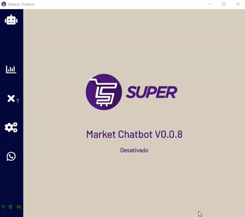
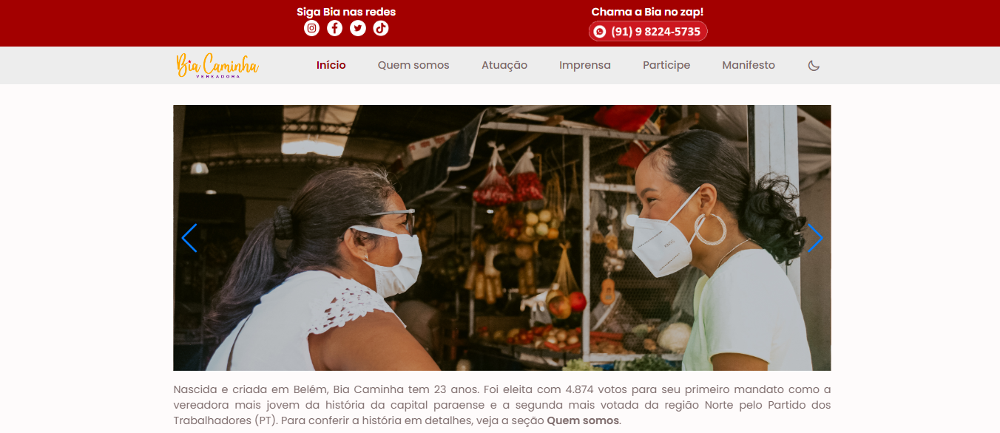
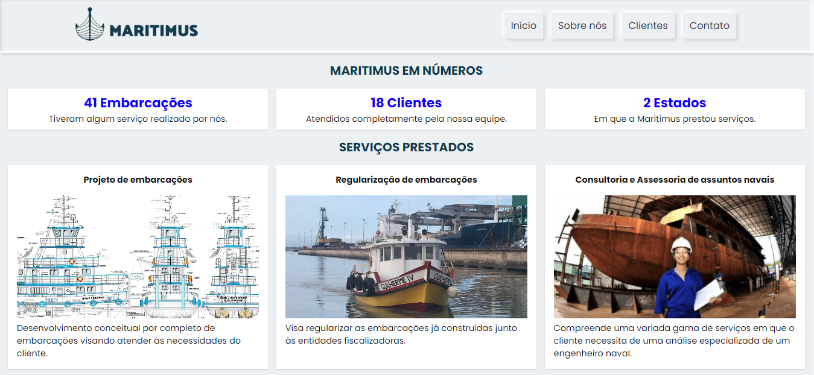
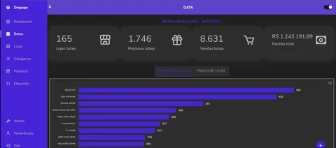
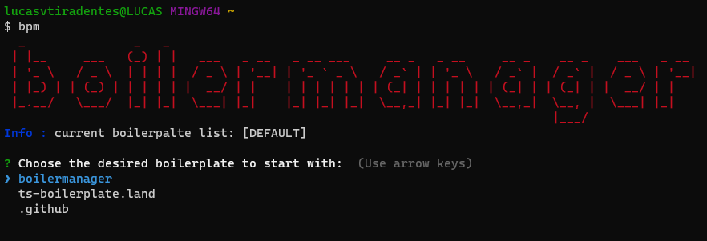
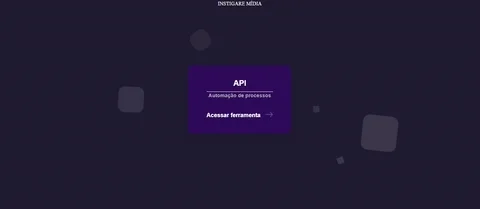
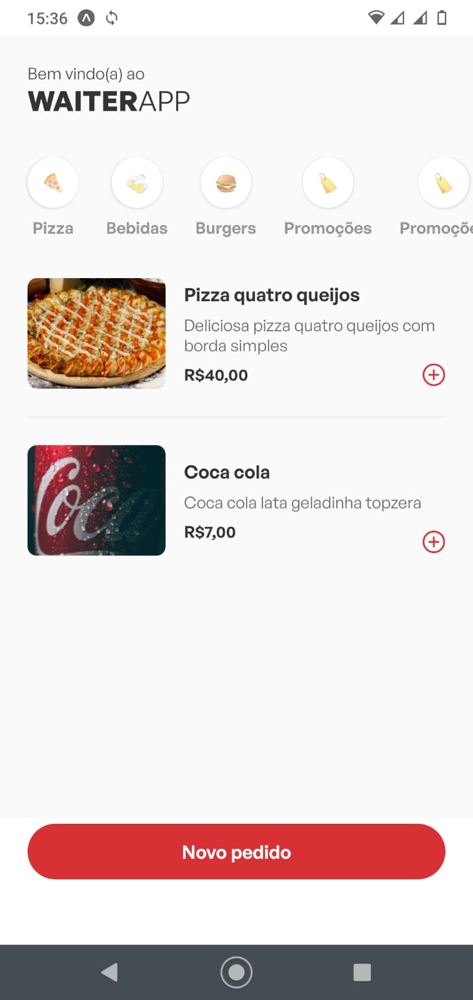
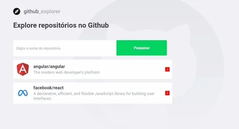
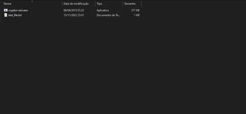

<h3 align="center">
  ALL MY GITHUB PROJECTS (18)
</h3>

  
  
  
  

  <a href="#briefcase-work-projects">Work (4)</a> • <a href="#star-open-source-projects">Open source (4)</a> • <a href="#books-practice-projects">Practice (7)</a> • <a href="#zap-other-projects">Other (3)</a>

## :briefcase: Work projects

  <table>
    <tr>
      <th width="215">Project</th>
      <th width="400">Description</th>
      <th width="215">Demo</th>
      <th width="100">Tech</th>
    </tr>
    <tr>
      <td align="center">
        <a href="https://github.com/lucasvtiradentes/supermarket-chatbot">supermarket-chatbot</a> 
        
      </td>
      <td align="left">🛒 an auto-updatable electron whatsapp chatbot made for sending supermarket customers warning and informative messages whenever needed.</td>
      <td align="center">
        
      </td>
      <td>
        
        
        
        
      </td>
    </tr>
    <tr>
      <td align="center">
        <a href="https://github.com/lucasvtiradentes/biacaminha.com.br">biacaminha.com.br</a> 
        
      </td>
      <td align="left">👔 a brazillian state senator website, with an api and a admin page to manage its contents.</td>
      <td align="center">
        
      </td>
      <td align="center">
        
        
        
      </td>
    </tr>
    <tr>
      <td align="center">
        <a href="https://github.com/lucasvtiradentes/maritimusengenharia.com">maritimusengenharia.com</a> 
        
      </td>
      <td align="left">🚢 a naval architecture company's website with an API to run user validation related actions.</td>
      <td align="center">
        
      </td>
      <td align="center">
        
        
      </td>
    </tr>
    <tr>
      <td align="center">dropspy</td>
      <td align="left">🕵️ a complete cloud solution for tracking shopify stores sales, persisting data in a database and inspect it in a react dashboard. This is a private repository.</td>
      <td align="center">
        
      </td>
      <td align="center">
        
        
        
        
        
      </td>
    </tr>
  </table>

 

 

## :star: Open source projects

  <table>
    <tr>
      <th width="215">Project</th>
      <th width="400">Description</th>
      <th width="215">Demo</th>
      <th width="100">Tech</th>
    </tr>
    <tr>
      <td align="center">
        <a href="https://github.com/ts-boilerplate-land/boilermanager">boilermanager</a> 
        
      </td>
      <td align="left">⚡ A tool to allow you to choose boilerplate as well as manage yours, and quick start your projects.</td>
      <td align="center">
        
      </td>
      <td align="center">
        
        
      </td>
    </tr>
     <tr>
      <td align="center">
        <a href="https://github.com/lucasvtiradentes/shopify-store-omni-pixel">shopify-store-omni-pixel</a> 
        
      </td>
      <td align="left">🔎 Save webstores user behavior information into cookies and send events to ads and analytics platforms, like GA, Facebook and Tiktok.</td>
      <td align="center">
        
      </td>
      <td align="center">
        
        
      </td>
    </tr>
    <tr>
      <td align="center">
        <a href="https://github.com/lucasvtiradentes/ecommerce-stores-api">ecommerce-stores-api</a> 
        
      </td>
      <td align="left">🛍️ ecommerce API designed to be useful for stores owners, as it allows some messaging automation, getting order information from Aliexpress and Shopify, among other things.</td>
      <td align="center">
        
      </td>
      <td align="center">
        
        
        
        
      </td>
    </tr>
    <tr>
      <td align="center">
        <a href="https://github.com/lucasvtiradentes/ticktick-api-lvt">ticktick-api-lvt</a> 
        
      </td>
      <td align="left">📅 A ticktick api wrapper package to be used in node based projects.</td>
      <td align="center">N/A</td>
      <td align="center">
        
        
      </td>
    </tr>
  </table>

 

 

## :books: Practice projects

<h3 align="center">Advanced</h3>

  <table>
    <tr>
      <th width="215">Project</th>
      <th width="400">Description</th>
      <th width="215">Demo</th>
      <th width="100">Tech</th>
    </tr>
    <tr>
      <td align="center">
        <a href="https://github.com/lucasvtiradentes/notifications-microservice">notifications-microservice</a> 
        
      </td>
      <td align="left">💬 A notifications microservice to implements nesjts, kafka, prisma and some other tools.</td>
      <td align="center">N/A</td>
      <td align="center">
        
        
        
        
        
        
      </td>
    </tr>
    <tr>
      <td align="center">
        <a href="https://github.com/lucasvtiradentes/waiter-app-server ">waiter-app-server</a> 
        
      </td>
      <td align="left">🍔 waiter server to manage orders in restaurants.</td>
      <td align="center">
        
      </td>
      <td align="center">
        
        
        
        
      </td>
    </tr>
    <tr>
      <td align="center">
        <a href="https://github.com/lucasvtiradentes/waiter-app-mobile">waiter-app-mobile </a> 
        
      </td>
      <td align="left">🍔 waiter mobile app to manage orders.</td>
      <td align="center">
        
      </td>
      <td align="center">
        
        
        
        
      </td>
    </tr>
  </table>

<h3 align="center">Beginner</h3>

  <table>
    <tr>
      <th width="215">Project</th>
      <th width="400">Description</th>
      <th width="215">Demo</th>
      <th width="100">Tech</th>
    </tr>
    <tr>
      <td align="center">
        <a href="https://github.com/lucasvtiradentes/todo-app">todo-app</a> 
        
      </td>
      <td align="left">📝 basic todo application to practice next 13 new app folder structure features.</td>
      <td align="center">
        
      </td>
      <td align="center">
        
        
        
        
        
      </td>
    </tr>
    <tr>
      <td align="center">
        <a href="https://github.com/lucasvtiradentes/metaversus-landinpage">metaversus-landinpage</a> 
        
      </td>
      <td align="left">👨‍🚀 space landing page to practice my nextjs and tailwind skills.</td>
      <td align="center">
        
      </td>
      <td align="center">
        
        
        
        
        
      </td>
    </tr>
    <tr>
      <td align="center">
        <a href="https://github.com/lucasvtiradentes/covid19-cases-dashboard">covid19-cases-dashboard</a> 
        
      </td>
      <td align="left">💉 covid19 cases dashboard that allows users to check covide19 statistics globally and by country.</td>
      <td align="center">
        
      </td>
      <td align="center">
        
        
        
      </td>
    </tr>
    <tr>
      <td align="center">
        <a href="https://github.com/lucasvtiradentes/github-repo-explorer">github-repo-explorer</a> 
        
      </td>
      <td align="left">🖥️ github application that allow users to see github repos detailed informations.</td>
      <td align="center">
        
      </td>
      <td align="center">
        
        
        
      </td>
    </tr>
  </table>

 

 

## :zap: Other projects

  <table>
    <tr>
      <th width="215">Project</th>
      <th width="400">Description</th>
      <th width="215">Demo</th>
      <th width="100">Tech</th>
    </tr>
    <tr>
      <td align="center">
        <a href="https://github.com/lucasvtiradentes/cryptor">cryptor</a> 
        
      </td>
      <td align="left">🔏 file encoder/decoder application.</td>
      <td align="center">
        
      </td>
      <td align="center">
        
      </td>
    </tr>
    <tr>
      <td align="center">
        <a href="https://github.com/lucasvtiradentes/development-utils">development-utils</a> 
        
      </td>
      <td align="left">👨‍💻 all my useful development resources.</td>
      <td align="center">N/A</td>
      <td align="center">N/A</td>
    </tr>
    <tr>
      <td align="center">
        <a href="https://github.com/lucasvtiradentes/lucasvtiradentes">lucasvtiradentes</a> 
        
      </td>
      <td align="left">🚀 github description repository.</td>
      <td align="center">N/A</td>
      <td align="center">N/A</td>
    </tr>
  </table>

 

 

  
Made with ❤️ by Lucas Vieira.

  
👉 See also all <a href="https://github.com/lucasvtiradentes/lucasvtiradentes/blob/master/portfolio/ARTICLES.md#TOC">my articles</a>

  
👉 See also <a href="https://github.com/lucasvtiradentes/lucasvtiradentes/blob/master/portfolio/WORK_EXPERIENCE.md#TOC">my work experience</a>

