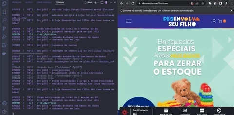
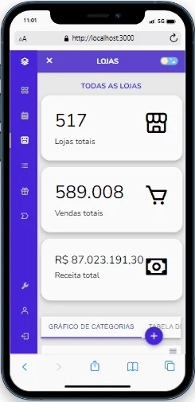

<h3 align="center">
  WORK EXPERIENCE TIMELINE
</h3>

  
  
  
  

  <a href="#credit_card-instigare-mídia">instigare mídia</a> • <a href="#ship-maritimus-engenharia">maritimus</a> • <a href="#computer-appsuper">appsuper</a>

  
see <b>table of content</b>

  

    <ul>
      <li>
        <a href="#credit_card-instigare-mídia">Instigare mídia</a>
        <ul>
          <li><a href="#shopify-sales-tracker-dropspy">shopify sales tracker (DROPSPY)</a></li>
          <li><a href="#ecommerce-stores-api">ecommerce stores api</a></li>
          <li><a href="#automated-google-spreadsheets">automated google spreadsheets</a></li>
        </ul>
      </li>
      <li>
        <a href="#ship-maritimus-engenharia">Maritimus engenharia</a>
        <ul>
          <li><a href="#automated-excel-spreadsheets">Automated excel spreadsheets</a></li>
          <li><a href="#company-website-and-api">company website and API</a></li>
        </ul>
      </li>
      <li>
        <a href="#computer-appsuper">Appsuper</a>
        <ul>
          <li><a href="#supermarket-chatbot">supermarket chatbot</a></li>
          <li><a href="#company-kpi-dashboard">company kpi dashboard</a></li>
          <li><a href="#fraud-analysis-chrome-extension">fraud analysis chrome extension</a></li>
          <li><a href="#ecommerce-products-scrapper">ecommerce products scrapper</a></li>
        </ul>
      </li>
    </ul>
  

## :credit_card: Instigare mídia

### shopify sales tracker (DROPSPY)

Developed a complete solution for tracking ecommerce competitors sales, so we could see which products and marketing strategies were doing better. In three months it detected 18M USD in sales for 400+ stores, and helped the company to double revenue applying the knowledge we acquired with the data;

it is composed by three parts: (1) a cloud based worker bot to spy stores using alihunter extension, (2) a mongodb database to persist data and (3) a beautiful react dashboard to analyse stored information.

  <table>
    <tr>
      <th>Scope</th>
      <th>Image</th>
    </tr>
    <tr>
      <td align="center">dropspy bot</td>
      <td align="center"></td>
    </tr>
    <tr>
      <td align="center">dropspy server web</td>
      <td align="center">
        
      </td>
    </tr>
    <tr>
      <td align="center">dropspy server mobile</td>
      <td align="center">
      </td>
    </tr>
  </table>

### [shopify store omni pixel](https://github.com/lucasvtiradentes/shopify-store-omni-pixel)

Developed a web data analytics tool system similar to Google Analytics, where we implemented a front end pixel that collects visitors' online behavior and sends information to a google spreadsheets, so we could use data analysis to show better offers and convert them into actual customers, all this under the GDPR law;

### [ecommerce stores api](https://github.com/lucasvtiradentes/ecommerce-stores-api)

Developed an API for internal usage to automate tasks, such as searching the products prices on the supplier's website, notifying customers in Whatsapp, among others.

### automated google spreadsheets

Automated most of our daily work using google spreadsheets and its script language (google app script), which is similar to javascript. some of automated tasks: facebook ads reports, generating daily sales reports, among others.

## :ship: Maritimus engenharia

Naval architecture & software on demand company

### automated excel spreadsheets

Automated most of the internal process, such as adding VBA to excel spreadsheets, which made our engineering projects incredible faster (saving about 4/6 hours in each project);

### [company website and API](https://github.com/lucasvtiradentes/maritimusengenharia.com)

Developed the company’s portfolio website with an API for internal usage, such as to allow only specific people to use these spreadsheets;

## :computer: Appsuper

Supermarket orders delivery startup company.

### [supermarket-chatbot](https://github.com/lucasvtiradentes/supermarket-chatbot)

I made a electron whatsapp chatbot in order to send messages to customers when needed. It helped a lot our support team, since it fixed our most commom reasons to contact customers.

### company kpi dashboard

A complete dashboard to visualize our company's most relevant KPI's, such as best selling products, best selling supermarkets, customers categorized by years, orders per weekday, among many others.

### fraud analysis chrome extension

This was an chrome extension made to boost speed when analysing orders to detect possible frauds, it was crucial when our per day orders increased 300% in May 2020.

### ecommerce products scrapper

a scrapper application to get valuable data from our competitors to add in our system/app, built using nodejs and puppeteer.

 

  
Made with ❤️ by Lucas Vieira.

  
👉 See also all <a href="https://github.com/lucasvtiradentes/lucasvtiradentes/blob/master/portfolio/ARTICLES.md#TOC">my articles</a>

  
👉 See also all <a href="https://github.com/lucasvtiradentes/lucasvtiradentes/blob/master/portfolio/PROJECTS.md#TOC">my projects</a>

